# SuiProof - Blockchain-Verified Media Authentication

<div align="center">

**Zero-Friction Content Verification from Field Capture to Public Consumption**

[](https://sui.io)
[](https://nextjs.org)
[](https://move-language.github.io/)
[](https://www.typescriptlang.org/)

</div>

---

## 🎯 What is SuiProof?

SuiProof is a **decentralized content verification platform** built on the Sui blockchain that creates immutable "birth certificates" for media content. It enables journalists, news organizations, and content creators to **prove authenticity** and **trace lineage** of digital media in an era of deepfakes and AI-generated content.

### The Problem

- **Deepfakes** are increasingly indistinguishable from real content
- **Edited images** lose connection to their original source
- **Misinformation** spreads faster than fact-checking can keep up
- **Traditional verification** requires trusting centralized authorities

### The Solution

SuiProof implements a **"Source-to-Screen"** workflow that:

1. ✅ **Captures metadata** at the moment of creation (GPS, timestamp, device ID)
2. ✅ **Anchors cryptographic hashes** on Sui's immutable blockchain
3. ✅ **Tracks edit lineage** through parent-child relationships
4. ✅ **Enables instant verification** by anyone, anywhere
5. ✅ **Removes friction** via institutional gas sponsorship

---

## 🏛️ Architecture: The "Source-to-Screen" Flow

### Phase 1: Institutional Onboarding


### Phase 2: The "Shutter Click" (Zero-Friction Capture)

```mermaid
graph TD
    A[📸 Journalist Captures Photo] --> B[App Generates BLAKE2b Hash]
    B --> C[Upload to IPFS/Pinata]
    C --> D[Send to Institutional Node]
    D --> E{Who Pays Gas?}
    E -->|Institution Sponsors| F[Node Signs & Executes PTB]
    E -->|Direct Wallet| G[User Signs Transaction]
    F --> H[MediaManifest Minted on Sui]
    G --> H
    H --> I[✅ Confirmation to Journalist]
```



### Phase 3: Editorial Review


### Phase 4: Public Verification

```mermaid
graph TD
    A[User Sees Content] --> B[Clicks Verify Badge]
    B --> C[Browser Hashes File]
    C --> D{Blockchain Query}
    D -->|Match Found| E[🟢 GREEN SEAL: Verified Original]
    D -->|Edit w/ Lineage| F[🟡 YELLOW SEAL: Verified Edit]
    D -->|No Match| G[🔴 RED WARNING: Unverified]
```



**[📖 Full Implementation Guide](./docs/SOURCE_TO_SCREEN_FLOW.md)**

---

## 🚀 Quick Start

### Prerequisites

- Node.js 18+
- Sui CLI ([Install Guide](https://docs.sui.io/build/install))
- Sui wallet with testnet SUI
- Pinata account (free tier works)

### 1. Deploy Smart Contract

```bash
cd sui
sui client publish --gas-budget 100000000
# Save the Package ID!
```

### 2. Set Up Institutional Node

```bash
cd institutional-node
npm install
cp .env.example .env
# Edit .env with your sponsor private key and Package ID
npm run dev
```

### 3. Start Frontend

```bash
npm install
cp .env.local.example .env.local
# Edit .env.local with Package ID and Pinata JWT
npm run dev
```

Visit http://localhost:3000

**[📖 Detailed Setup Guide](./docs/QUICK_START.md)**

---

## 📂 Project Structure

```
SuiProof/
├── sui/                           # Smart Contract (Move)
│   ├── sources/
│   │   └── suiproof.move         # Core contract: Agency, PressPass, MediaManifest
│   └── Published.toml            # Deployment metadata
│
├── institutional-node/            # Backend Service (Node.js + Express)
│   ├── src/
│   │   └── index.ts              # Gas sponsorship server
│   ├── package.json
│   └── README.md                 # Institutional node documentation
│
├── src/                           # Frontend (Next.js 14)
│   ├── app/
│   │   ├── page.tsx              # Main application
│   │   └── actions.ts            # Server actions (blockchain queries)
│   ├── components/
│   │   ├── dashboard-view.tsx    # Journalist dashboard
│   │   ├── verifier-view.tsx     # Public verification interface
│   │   └── new-anchor-modal.tsx  # Content anchoring modal
│   └── lib/
│       ├── sui.ts                # Sui SDK utilities
│       ├── institutional-node.ts # API client for sponsored txs
│       └── pinata.ts             # IPFS integration
│
└── docs/
    ├── SOURCE_TO_SCREEN_FLOW.md  # Complete implementation guide
    └── QUICK_START.md            # 5-minute setup tutorial
```

---

## 🔑 Key Features

### For Journalists

- ✅ **Zero-friction anchoring**: No gas fees, no seed phrases
- ✅ **Instant proof of capture**: GPS + timestamp + hash locked on-chain
- ✅ **Mobile-first workflow**: Designed for field photography

### For News Organizations

- ✅ **Credentialing system**: Issue PressPass NFTs to verified journalists
- ✅ **Gas sponsorship**: Organization pays blockchain fees
- ✅ **Audit trail**: Immutable record of all published content

### For the Public

- ✅ **Instant verification**: Drag any image to check authenticity
- ✅ **Trustless validation**: No need to trust SuiProof - verify on Sui blockchain
- ✅ **Edit lineage tracking**: See if content has been modified

### For Editors

- ✅ **Provenance preservation**: Edited versions link back to originals
- ✅ **Transparent modifications**: "Cropped 20%" recorded on-chain
- ✅ **No metadata loss**: Original GPS/timestamp inherited

---

## 🛠️ Technology Stack

| Layer              | Technology         | Purpose                                |
| ------------------ | ------------------ | -------------------------------------- |
| **Blockchain**     | Sui Network        | Immutable ledger for metadata          |
| **Smart Contract** | Move Language      | AgencyObject, PressPass, MediaManifest |
| **Backend**        | Node.js + Express  | Gas sponsorship service                |
| **Frontend**       | Next.js 14 + React | User interface                         |
| **Storage**        | Pinata (IPFS)      | Decentralized file storage             |
| **Hashing**        | BLAKE2b-512        | Cryptographic fingerprinting           |
| **Wallet**         | Suiet/Ethos        | Sui wallet integration                 |

---

## 📊 Smart Contract Overview

### Core Structs

**AgencyObject** - News organization identity

```move
public struct AgencyObject has key {
    id: UID,
    name: String,          // "Associated Press"
    agency_id: String,     // "SUI_AP_091"
    admin: address,
    created_at: u64,
}
```

**PressPass** - Journalist credential

```move
public struct PressPass has key, store {
    id: UID,
    agency_id: String,
    journalist: address,
    journalist_name: String,
    issued_at: u64,
    expires_at: u64,
    is_active: bool,
}
```

**MediaManifest** - Content "birth certificate"

```move
public struct MediaManifest has key, store {
    id: UID,
    ipfs_cid: String,           // "QmX..."
    content_hash: vector<u8>,   // BLAKE2b hash
    gps_coordinates: String,    // "14.5995° N, 120.9842° E"
    agency_id: String,
    creator: address,
    created_at: u64,
    parent_id: ID,              // Links to original for edits
    edit_type: String,          // "Cropped 20%", "Color Correction"
    is_original: bool,
}
```

---

## 🔐 Security Model

### Cryptographic Hash Verification

- **BLAKE2b-512**: Faster than SHA-256, quantum-resistant
- **Single-pixel sensitivity**: Any modification changes the entire hash
- **Client-side hashing**: Browser generates hash before upload

### Decentralized Storage

- **IPFS via Pinata**: Content-addressed storage
- **Redundancy**: Files pinned across multiple nodes
- **Censorship-resistant**: No central authority can delete files

### Institutional Sponsorship

- **Separation of concerns**: Journalist owns content, institution pays gas
- **Rate limiting**: Prevents abuse of sponsorship
- **Press pass validation**: Only credentialed journalists can use service

---

## 📈 Use Cases

### 1. War Photography

- Journalist embeds with military unit
- Captures photo of humanitarian crisis
- SuiProof anchors exact GPS + timestamp on-chain
- Public can verify content wasn't staged or AI-generated

### 2. Sports Journalism

- Photographer captures game-winning moment
- Image anchored with stadium GPS coordinates
- Editor crops for front page
- Cropped version links back to original via `parent_id`
- Readers can verify authenticity and see edit history

### 3. Citizen Journalism

- Eyewitness records breaking news event
- Uploads via SuiProof mobile app
- News outlet licenses content
- Blockchain proves copyright and timestamp

### 4. Academic Research

- Researcher publishes study with data visualizations
- SuiProof anchors all graphs/images
- Peer reviewers can verify no data manipulation
- Retractions tracked via edit lineage

---

## 🚧 Roadmap

- [x] **Phase 1**: Core smart contract (Agency, PressPass, MediaManifest)
- [x] **Phase 2**: Institutional node for gas sponsorship
- [x] **Phase 3**: Edit lineage tracking (parent_id system)
- [x] **Phase 4**: Public verification interface
- [ ] **Phase 5**: Mobile app (iOS/Android)
- [ ] **Phase 6**: Editor plugins (Photoshop, Lightroom)
- [ ] **Phase 7**: zkLogin integration (passwordless auth)
- [ ] **Phase 8**: AI detection integration
- [ ] **Phase 9**: Cross-chain verification
- [ ] **Phase 10**: Decentralized indexer

---

## 🤝 Contributing

We welcome contributions! See our [Contributing Guide](./CONTRIBUTING.md) for details.

### Development Setup

```bash
# Clone repository
git clone https://github.com/your-org/suiproof.git
cd suiproof

# Install dependencies
npm install
cd institutional-node && npm install && cd ..
cd sui && sui move build && cd ..

# Run tests
npm test
cd sui && sui move test && cd ..

# Start development
npm run dev
```

---

## 📄 License

MIT License - see [LICENSE](./LICENSE) file for details.

---

## 🙏 Acknowledgments

- **Sui Foundation** - Blockchain infrastructure
- **Mysten Labs** - Move language and SDK
- **Pinata** - IPFS pinning service
- **Journalism community** - Use case validation

---

## 📞 Support

- **Documentation**: [docs/](./docs/)
- **Discord**: [Join Community](#)
- **Twitter**: [@SuiProof](#)
- **Email**: support@suiproof.com

---

<div align="center">

**Built with ❤️ for truth in journalism**

[Website](#) • [Docs](./docs/) • [GitHub](https://github.com/your-org/suiproof)

</div>
